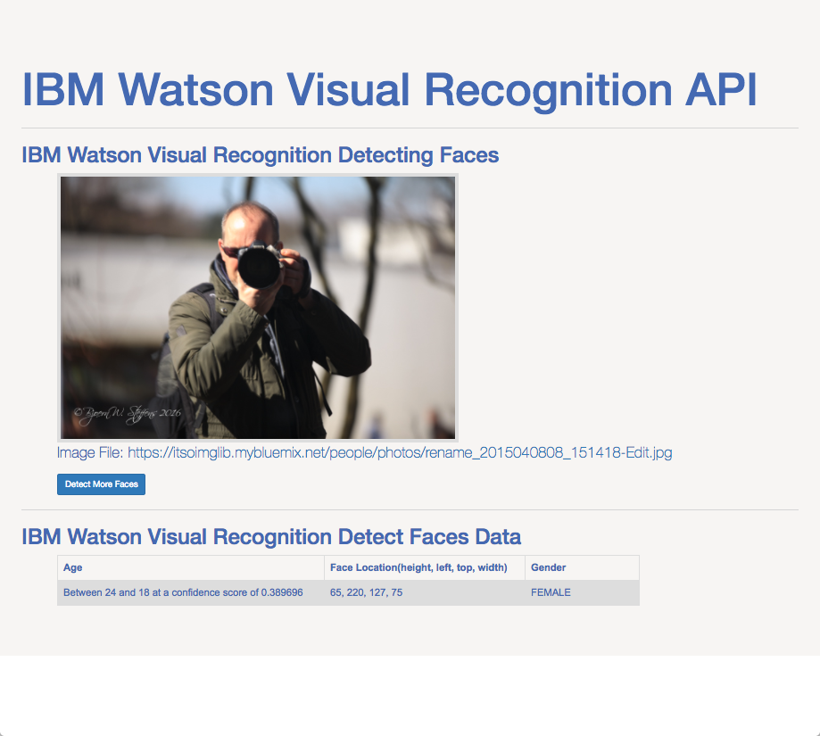

# Watson Visual Recognition API
&nbsp;

### Objectives
These code samples demonstrates how to use the Watson Visual Recognition API to detect items in images and also how to train the API to recognize your custom classes.
&nbsp;

### How to use the sample material
In each folder there is a word document describing what you need to go through to setup the samples and run the code. This should give you a good understandning of how to use this API and get you a flying start with your project. Happy coding!
&nbsp;

### Node.js API Call Results Page
&nbsp;

